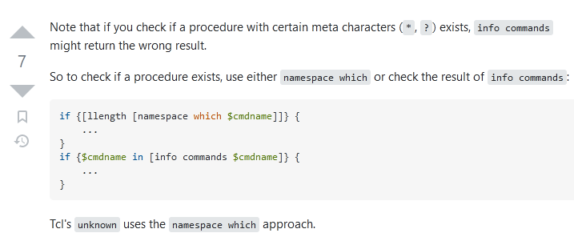

# a document
## section 1

a little text `embedded code`



```gnuplot
xxxxx
set grid
plot x
```

```gnuplot
set grid
plot x*x
```


## ☐ a task todo
## W a task to wait for
## ► a task in progress
## ✓ a task which is done


with notes


```c
if(embedded_code) {
	do_nothing();
}
```


